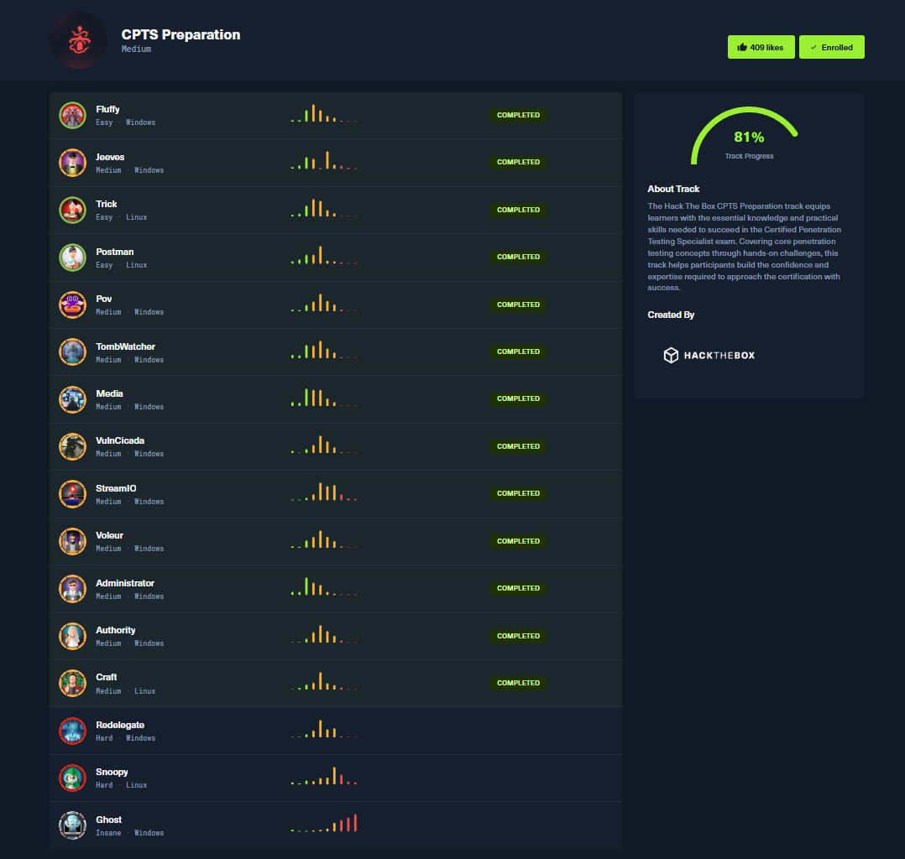

**LFI**
.ssh/id_rsa` or `.ssh/id_ed25519` (Private Keys)


**Sqlite3**
-sqlite3 <file_database>

**AWS**

-aws configure (but nedd to export the key first using export)
-aws --end-point -url http://ip:54321 s3 ls
-aws --end-point -url http://ip:54321 s3 ls s3://fileshow


**Metasploit**

```shell-session
<No.> <type>/<os>/<service>/<name>
```

```shell-session
794   exploit/windows/ftp/scriptftp_list
```

|**Type**|**Description**|
|---|---|
|`Auxiliary`|Scanning, fuzzing, sniffing, and admin capabilities. Offer extra assistance and functionality.|
|`Encoders`|Ensure that payloads are intact to their destination.|
|`Exploits`|Defined as modules that exploit a vulnerability that will allow for the payload delivery.|
|`NOPs`|(No Operation code) Keep the payload sizes consistent across exploit attempts.|
|`Payloads`|Code runs remotely and calls back to the attacker machine to establish a connection (or shell).|
|`Plugins`|Additional scripts can be integrated within an assessment with `msfconsole` and coexist.|
|`Post`|Wide array of modules to gather information, pivot deeper, etc.|

```shell-session

msf6 > search eternalromance type:exploit
```

```shell-session
search type:exploit platform:windows cve:2021 rank:excellent microsoft
```

