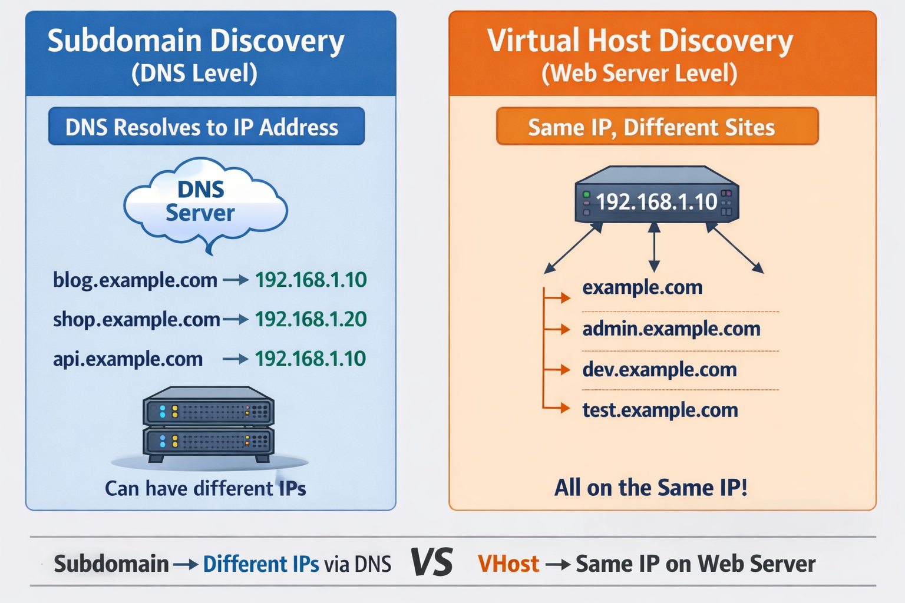
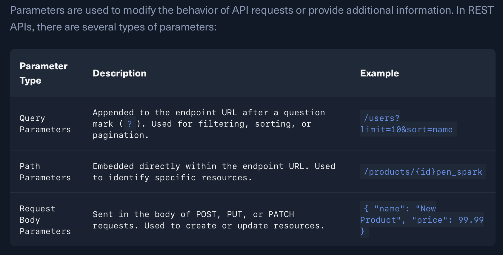
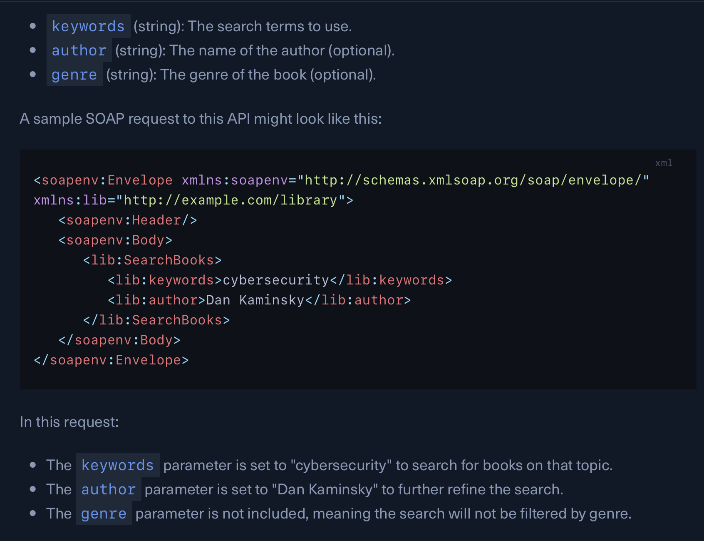
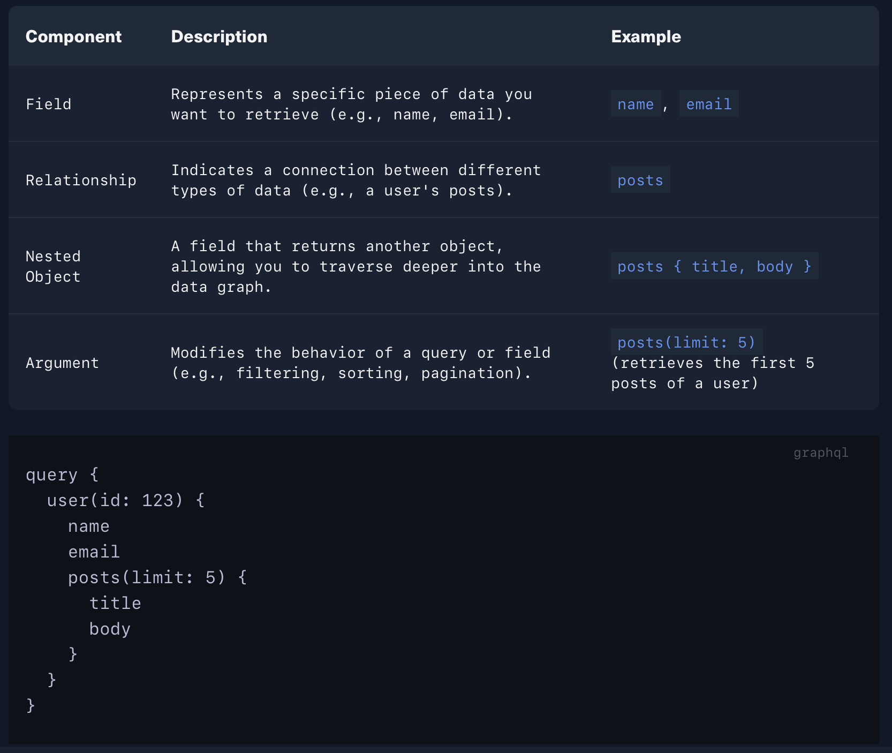
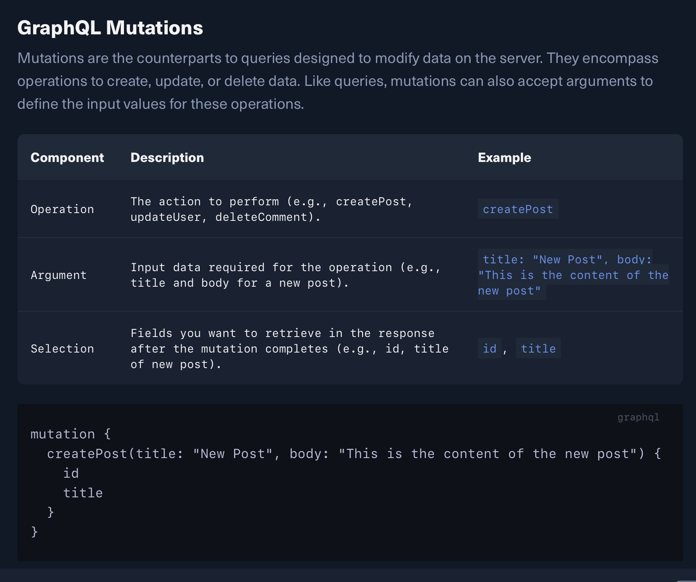

**Introduction**

What is Web fuzzing?

- Web fuzzing is a critifcal technique in web application security to identify vulnerabilities by testing various inputs. It involves automated testing of web applications by providing unexpected or random data to detect potential flaws that attackers could exploit.


Fuzzing vs Brute-Forcing

###################

- Fuzzing is when you send many unusual or unexpected inputs to a web application to see how it behaves. These inputs can include random text, strange characters, invalid data, or broken formats.

- The goal is to check if the application crashes, show errors, or behaves in an insecure way when it receives something unexpected.

- Fuzzing tools often use wordlists, mutated inputs, or random payloads to test many different cases automatically.

- Example:

~~~~~~~~~~~~~~~~~~~~~~~~~~~~~~~~~
admin'
<script>
%%%%
../../etc/passwd
~~~~~~~~~~~~~~~~~~~~~~~~~~~~~~~~~

###################

- Brute-Forcing, however, is more focused on guessing a specific value. It tries many possible combinations until it finds the correct one.

- Such as:
   → Guessing a password
   → Finding a valid login
   → Trying many ID numbers
   
- Brute-force tools usually use dictionaries or lists of possible values and try them one by one.

- Example: 
```
123456
password
admin123
qwerty
```

You can install `FFUF` using the following command:

```
go install github.com/ffuf/ffuf/v2@latest
```


You can install `GoBuster` using the following command:

```
go install github.com/OJ/gobuster/v3@latest
```

To install `FeroxBuster`, you can use the following command:

```
curl -sL https://raw.githubusercontent.com/epi052/feroxbuster/main/install-nix.sh | sudo bash -s $HOME/.local/bin
```


One of the most comprehensive and widely-used collections of wordlists is `SecLists`. This open-source project on 

```
https://github.com/danielmiessler/SecLists
```


ffuf command syntax:

```
ffuf -w /usr/share/seclists/Discovery/Web-Content/common.txt -u http://IP:PORT/FUZZ -e .php,.html,.txt,.bak,.js,.aspx,.asp -v
```

## Extension Fuzzing

```
Note: However, there is one file we can always find in most websites, which is `index.*`
```

```
ffuf -w /opt/useful/seclists/Discovery/Web-Content/web-extensions.txt:FUZZ -u http://SERVER_IP:PORT/blog/indexFUZZ
```

## Page Fuzzing

```
ffuf -w /opt/useful/seclists/Discovery/Web-Content/directory-list-2.3-small.txt:FUZZ -u http://SERVER_IP:PORT/blog/FUZZ.php
```

Recursive fuzzing is an automated way to delve into depths of a web application's directory structure.

```
ffuf -w /usr/share/seclists/Discovery/Web-Content/directory-list-2.3-medium.txt -ic -v -u http://IP:PORT/FUZZ -e .html -recursion
```

```
ffuf -w /usr/share/seclists/Discovery/Web-Content/directory-list-2.3-medium.txt -ic -v -u http://IP:PORT/FUZZ -e .html -recursion /'___\ /'___\ /'___\ /\ \__/ /\ \__/ __ __ /\ \__/ \ \ ,__\\ \ ,__\/\ \/\ \ \ \ ,__\ \ \ \_/ \ \ \_/\ \ \_\ \ \ \ \_/ \ \_\ \ \_\ \ \____/ \ \_\ \/_/ \/_/ \/___/ \/_/ v2.1.0-dev ________________________________________________ :: Method : GET :: URL : http://IP:PORT/FUZZ :: Wordlist : FUZZ: /usr/share/seclists/Discovery/Web-Content/directory-list-2.3-medium.txt :: Extensions : .html :: Follow redirects : false :: Calibration : false :: Timeout : 10 :: Threads : 40 :: Matcher : Response status: 200-299,301,302,307,401,403,405,500 ________________________________________________ [Status: 301, Size: 0, Words: 1, Lines: 1, Duration: 0ms] | URL | http://IP:PORT/level1 | --> | /level1/ * FUZZ: level1 [INFO] Adding a new job to the queue: http://IP:PORT/level1/FUZZ [INFO] Starting queued job on target: http://IP:PORT/level1/FUZZ [Status: 200, Size: 96, Words: 6, Lines: 2, Duration: 0ms] | URL | http://IP:PORT/level1/index.html * FUZZ: index.html [Status: 301, Size: 0, Words: 1, Lines: 1, Duration: 0ms] | URL | http://IP:PORT/level1/level2 | --> | /level1/level2/ * FUZZ: level2 [INFO] Adding a new job to the queue: http://IP:PORT/level1/level2/FUZZ [Status: 301, Size: 0, Words: 1, Lines: 1, Duration: 0ms] | URL | http://IP:PORT/level1/level3 | --> | /level1/level3/ * FUZZ: level3 [INFO] Adding a new job to the queue: http://IP:PORT/level1/level3/FUZZ [INFO] Starting queued job on target: http://IP:PORT/level1/level2/FUZZ [Status: 200, Size: 96, Words: 6, Lines: 2, Duration: 0ms] | URL | http://IP:PORT/level1/level2/index.html * FUZZ: index.html [INFO] Starting queued job on target: http://IP:PORT/level1/level3/FUZZ [Status: 200, Size: 126, Words: 8, Lines: 2, Duration: 0ms] | URL | http://IP:PORT/level1/level3/index.html * FUZZ: index.html :: Progress: [441088/441088] :: Job [4/4] :: 100000 req/sec :: Duration: [0:00:06] :: Errors: 0 ::
```


- `-recursion-depth`: This flag allows you to set a maximum depth for recursive exploration. For example, `-recursion-depth 2` limits fuzzing to two levels deep (the starting directory and its immediate subdirectories).

	Example:
	
	```
	/recursive_fuzz/FUZZ  
	/recursive_fuzz/admin/FUZZ  
	/recursive_fuzz/admin/panel/FUZZ  
	/recursive_fuzz/admin/panel/secret/FUZZ
	```
		
	### `-recursion-depth 1`

	```
	-recursion -recursion-depth 1
	```
	
	
	ffuf scans:

	```
	/recursive_fuzz/FUZZ
	```
	
	
	and **one level deeper only if it finds directories**:
	
	```
	/recursive_fuzz/admin/FUZZ
	```
	
	But it **will NOT scan deeper**.
	
	### `-recursion-depth 2`

```
-recursion -recursion-depth 2
```
	
	ffuf scans:
	
```
/recursive_fuzz/FUZZ  
/recursive_fuzz/admin/FUZZ  
/recursive_fuzz/admin/panel/FUZZ
```
	
- `-rate`: You can control the rate at which `ffuf` sends requests per second, preventing the server from being overloaded.
- `-timeout`: This option sets the timeout for individual requests, helping to prevent the fuzzer from hanging on unresponsive targets.
- `-ic` : Ignore Comments

	Example: Without `-ic`

	```
	# common admin directories
	admin
	login
	dashboard

	# backup files
	backup
	old
	```

	With `-ic`

```
admin
login
dashboard
backup
old
```


GET 

GET sends data in the URL.

Example

```
http://example.com/search?query=security
```

```
|Part           |Meaning|
 
|`query`        |parameter|
|`security`     |value|
```

```
ffuf -u "http://154.57.164.68:30875/get.php?x=FUZZ" \                                         
-w /usr/share/seclists/Discovery/Web-Content/common.txt \
-mc all -fc 404
```

```
Wordlist: /opt/useful/seclists/Discovery/Web-Content/burp-parameter-names.txt
```

```
curl http://IP/get.php?x=OPEN
```

```
- Data is visible in the URL
    
- Used for retrieving data
    
- Can be bookmarked
    
- Length is limited
```

**POST Parameter**

```
ffuf -u http://154.57.164.68:30875/post.php -X POST -H "Content-Type: application/x-www-form-urlencoded" -d "y=FUZZ" -w /usr/share/seclists/Discovery/Web-Content/common.txt -mc 200 -v
```

```
Tip: In PHP, "POST" data "content-type" can only accept "application/x-www-form-urlencoded". So, we can set that in "ffuf" with "-H 'Content-Type: application/x-www-form-urlencoded'".
```

```
Wordlists: /usr/share/seclists/Usernames/Names/names.txt
```

```
curl http://154.57.164.68:30875/post.php -d "y=SUNWmc"
```

```
- Data not visible in URL
    
- Used for sending data to server
    
- Often used in forms
    
- No strict length limit
```

```
|Option        |Meaning|

|`-X POST`     |send POST request|
|`-d`          |data in request body|
|`y=FUZZ`      |fuzz the value of y|
|`-w`          |wordlist|
```


**Add ip with domain**

```
cho "IP inlanefreight.htb" | sudo tee -a /etc/hosts
```

## Virtual Host and Subdomain Fuzzing

### 1. Subdomain Fuzzing (DNS level)

This method checks if the **DNS server knows the subdomain**.

Example target:

```
example.com
```


You try words like:

```
admin.example.com  
dev.example.com  
api.example.com
```

Command:

```
ffuf -u https://FUZZ.example.com -w subdomains.txt (too slow)

gobuster dns --do inlanefreight.com -w /usr/share/seclists/Discovery/DNS/subdomains-top1million-5000.txt

gobuster dns --do inlanefreight.com -w /usr/share/seclists/Discovery/DNS/subdomains-top1million-5000.txt --wildcard
```

Example Output:

```
www.inlanefreight.com 134.209.24.248,2a03:b0c0:1:e0::32c:b001
ns1.inlanefreight.com 178.128.39.165
ns2.inlanefreight.com 206.189.119.186
blog.inlanefreight.com 134.209.24.248,2a03:b0c0:1:e0::32c:b001
ns3.inlanefreight.com 134.209.24.248
support.inlanefreight.com 134.209.24.248
my.inlanefreight.com 134.209.24.248
```


```
Note: In the latest Gobuster release, `-d` now sets the delay between requests, not the domain. Use `--do` or `--domain` to specify the target domain if you are using the latest version.
```

---

### 2. Virtual Host Fuzzing (web server level)

Sometimes the **DNS does NOT contain the subdomain**, but the **web server still has a virtual host configured**.

Example server:

```
IP: 10.10.10.5
```


Hidden virtual host:

```
admin.internal  
dev.internal  
secret.example.com
```


Command:

```
ffuf -u http://10.10.10.5 -H "Host: FUZZ.domain" -w vhosts.txt

gobuster vhost -u http://inlanefreight.htb:81 -w /usr/share/seclists/Discovery/Web-Content/common.txt --append-domain
```

```
Note: domain must specific in /etc/hosts
```

Example Output:

```
Admin                   [Status: 200, Size: 100, Words: 4, Lines: 2, Duration: 203ms]
ADMIN                   [Status: 200, Size: 100, Words: 4, Lines: 2, Duration: 218ms]
admin                   [Status: 200, Size: 100, Words: 4, Lines: 2, Duration: 189ms]
awmdata                 [Status: 200, Size: 104, Words: 4, Lines: 2, Duration: 192ms]
ipdata                  [Status: 200, Size: 102, Words: 4, Lines: 2, Duration: 189ms]
web-beans               [Status: 200, Size: 108, Words: 4, Lines: 2, Duration: 189ms]
```


When we now specific vhost:

```
ffuf -u http://154.57.164.78:30369 \
-H "Host: web-FUZZ.inlanefreight.htb" \
-w /usr/share/seclists/Discovery/Web-Content/common.txt
```




**Filtering Fuzzing Output**

**Gobuster**

the `-s` and `-b` options are only available in the `dir` fuzzing mode.


```
-s(include): Include only responses with the specified status codes (comma-separated).

Syntax: -s 301, -s 301,302,200
```

```
-b(exclude): Exclude responses with the specified status codes (comma-separated).

Syntax: -b 404
```

```
--exclude-length: Exclude responses with specific content lengths (comma-separated, supports ranges).

Syntax: --exclude-length 0,404
```


**Command:**

```
gobuster dir -u http://example.com/ -w wordlist.txt -s 200,301 -x php,html,txt,bak --exclude-length 0
```


**FFUF**

```
-mc (match code): Include only responses that match the specified status codes. 

Syntax: -mc 200, -mc 200,204, -mc 400-499
```

```
-fc (filter code): Exclude responses that match the specified status codes like 404 Not Found.

Syntax: -fc 404
```

```
-fs (filter size): Exclude or hide responses with a specific size or range of sizes. 

Syntax: -fs 0 for empty responses, -fs 100-200 for responses between 100 and 200 bytes), -fs 0-1023 larger than 1KB
```

```
-ms (match size): Include or show only responses that match a specific size or range of sizes, using the same format as `-fs`.

Syntax: -ms 3456, -ms >500, -ms 10240-102400 (rarely to use it need to know the exactly the file size)
```

```
-fw (filter out number of words in response): Exclude responses containing the specified number of words in the response.

Syntax: -fw 219 (rarely to use)
```

```
-mw (match word count): Include only responses that have the specified amount of words in the response body. You're looking for short, specific error messages, to filter for responses with 5 to 10 words.

Syntax: -mw 5-10 (rarely to use)
```

```
-fl (filter line): Exclude responses with a specific number of lines or range of lines. For example, `-fl 5` will filter out responses with 5 lines.|You notice a pattern of 10-line error messages. 

Syntax: -fl 10 
```

```
-ml (match line count): Include only responses that have the specified amount of lines in the response body.You're looking for responses with a specific format, such as 20 lines. 

Syntax: -ml 20
```

```
-mt (match time): Include only responses that meet a specific time-to-first-byte (TTFB) condition. This is useful for identifying responses that are unusually slow or fast speically to the sensitive data of the application like SQl, Discover Heavy Backend Endpoints

Syntax: -mt >500 (Show endpoints that respond slower than 500ms)

Output:
report      [Status: 200, Time: 1200ms]
backup      [Status: 200, Time: 980ms]
export      [Status: 200, Time: 1500ms]
```

```
-t (Threat): make a fuzz become more faster but can become DOS

Syntax: -t 50
```

```
-v (verbose): give all output of request

Syntax: -v
```

**Command:**

```
# Find directories with status code 200, based on the amount of words, and a response size greater than 500 bytes Chanserey@htb[/htb]$ ffuf -u http://example.com/FUZZ -w wordlist.txt -mc 200 -fw 427 -ms >500 

# Filter out responses with status codes 404, 401, and 302 Chanserey@htb[/htb]$ ffuf -u http://example.com/FUZZ -w wordlist.txt -fc 404,401,302 

# Find backup files with the .bak extension and size between 10KB and 100KB ffuf -u http://example.com/FUZZ.bak -w wordlist.txt -fs 0-10239 -ms 10240-102400 

# Discover endpoints that take longer than 500ms to respond Chanserey@htb[/htb]$ ffuf -u http://example.com/FUZZ -w wordlist.txt -mt >500
```


**Wenum**

```
--hc (hide code): Exclude responses that match the specified status codes.|After fuzzing, the server returned many 400 Bad Request errors. 

Syntax: --hc 400
```

```
--sc (show code): Include only responses that match the specified status codes.|You are only interested in successful requests (200 OK). 

Syntax: --sc 200
```

```
--hl (hide length): Exclude responses with the specified content length (in lines).

Syntax: --hl with a high value to hide these and focus on shorter responses.
```

```
--sl (show length): Include only responses with the specified content length (in lines). You suspect a specific response with a known line count is related to a vulnerability. 

Syntax: --sl to pinpoint it.
```

```
--hw (hide word): Exclude responses with the specified number of words. The server includes common phrases in many responses. 

Syntax: --hw to filter out responses with those word counts.
```

```
--sw (show word): Include only responses with the specified number of words. You are looking for short error messages. 

Syntax: --sw with a low value to find them.
```

```
--hs (hide size): Exclude responses with the specified response size (in bytes or characters). The server sends large files for valid requests. 

Syntax: --hs to filter out these large responses and focus on smaller ones.
```

```
--ss (show size): Include only responses with the specified response size (in bytes or characters). You are looking for a specific file size. 

Syntax: --ss to find it.
```

```
--hr (hide regex): Exclude responses whose body matches the specified regular expression.|Filter out responses containing the "Internal Server Error" message. 

Syntax: --hr "Internal Server Error"`
```

```
--sr (show regex): Include only responses whose body matches the specified regular expression. Filter for responses containing the string "admin" 

Syntax: --sr "admin"
```

```
--filter / --hard-filter: General-purpose filter to show/hide responses or prevent their post-processing using a regular expression.

Syntax: --filter "Login" will show only responses containing "Login", while `--hard-filter "Login"` will hide them and prevent any plugins from processing them.
```


**Command:**

```
# Show only successful requests and redirects: 
wenum -w wordlist.txt --sc 200,301,302 -uh ttps://example.com/FUZZ 

# Hide responses with common error codes: Chanserey@htb[/htb]$ wenu -w wordlist.txt --hc 404,400,500 -u https://example.com/FUZZ 

# Show only short error messages (responses with 5-10 words): wenum -w wordlist.txt --sw 5-10 -u https://example.com/FUZZ 

# Hide large files and focus on smaller responses: Chanserey@htb[/htb]$ wenum -w wordlist.txt --hs 10000 -u https://example.com/FUZZ 

# Filter for responses containing specific information: Chanserey@htb[/htb]$ wenum -w wordlist.txt --sr "admin\|password" -u https://example.com/FUZZ
```


 **Feroxbuster**

```
--dont-scan (Request): Exclude specific URLs or patterns from being scanned (even if found in links during recursion). You know the `/uploads` directory contains only images, so you can exclude it 

Syntax: --dont-scan /uploads
```

```
-S, --filter-size: Exclude responses based on their size (in bytes). You can specify single sizes or comma-separated ranges.|You've noticed many 1KB error pages. 

Syntax: -S 1024 to exclude them.
```

```
-X, --filter-regex: Exclude responses whose body or headers match the specified regular expression. Filter out pages with a specific error message

Syntax: -X "Access Denied"
```

```
-W, --filter-words: Exclude responses with a specific word count or range of word counts.Eliminate responses with very few words (e.g., error messages) 

Syntax: -W 0-10
```

```
-N, --filter-lines: Exclude responses with a specific line count or range of line counts. Filter out long, verbose pages 

Syntax: -N 50-
```

```
-C, --filter-status: Exclude responses based on specific HTTP status codes. This operates as a denylist. Suppress common error codes like 404 and 500

Syntax: -C 404,500
```

```
--filter-similar-to: Exclude responses that are similar to a given webpage. Remove duplicate or near-duplicate pages based on a reference page 

Syntax: --filter-similar-to error.html
```

```
-s, --status-codes: Include only responses with the specified status codes. This operates as an allowlist (default: all).Focus on successful responses

Syntax: -s 200,204,301,302
```


**Command:**

```
# Find directories with status code 200, excluding responses larger than 10KB or containing the word "error" 
feroxbuster --url http://example.com -w wordlist.txt -s 200 -S 10240 -X "error"
```


**Web API**

```
REST, Many endpoints, JSON/XML, URL + HTTP methods

GraphQL, Usually one endpoint, JSON, Query language

SOAP, Usually one endpoint, XML, XML functions
```














When you see an API, test:

```
IDOR  
Auth bypass  
Mass assignment  
Method abuse  
Data leakage  
Injection  
Rate limit
```

# 1️⃣ IDOR (Insecure Direct Object Reference)

This is **one of the most common API vulnerabilities**.

API endpoint example:

```
GET /api/user?id=123
```


Response:

```
{  
 "id":123,  
 "name":"Alice"  
}
```


Now change the ID:

```
GET /api/user?id=124
```


If you can access another user's data → **IDOR vulnerability**.

### How to fuzz

```
ffuf -u "https://target.com/api/user?id=FUZZ" -w ids.txt
```

Look for:

- different users
    
- admin accounts
    
- private data
    

---

# 2️⃣ Broken Authentication

API login endpoints may be weak.

Example endpoint:

```
POST /api/login
```


Body:

```
{  
 "username":"admin",  
 "password":"admin"  
}
```

Test:

```
empty password  
default credentials  
SQL injection  
NoSQL injection
```


Example payload:

```
{  
 "username": {"$ne": null},  
 "password": {"$ne": null}  
}
```


This sometimes bypasses **MongoDB authentication**.

---

# 3️⃣ Mass Assignment

Sometimes APIs accept **extra fields** the developer forgot to restrict.

Example request:

```
{  
 "username":"test",  
 "password":"123456"  
}
```


Try adding:

```
{  
 "username":"test",  
 "password":"123456",  
 "role":"admin"  
}
```

If the server accepts it → **privilege escalation**.

Very common in REST and GraphQL.

---

# 4️⃣ HTTP Method Abuse

Developers may restrict one method but forget others.

Example endpoint:

```
/api/users/123
```

Try different methods:

```
GET  
POST  
PUT  
PATCH  
DELETE
```


Example test:

```
curl -X DELETE https://target.com/api/users/123
```


If it deletes data → **broken access control**.

---

# 5️⃣ GraphQL Introspection Data Leakage

GraphQL often exposes **the entire schema**.

Example query:

```
{  
 __schema {  
  types {  
   name  
  }  
 }  
}
```


This can reveal:

```
User  
Admin  
PasswordReset  
InternalLogs  
SecretToken
```

Now you know **hidden queries and mutations**.

---

# 6️⃣ XXE (XML External Entity) in SOAP APIs

SOAP uses **XML**, which may allow **XXE attacks**.

Example payload:

```
<!DOCTYPE foo [  
<!ENTITY xxe SYSTEM "file:///etc/passwd">  
]>
```

Insert into SOAP request:

```
<id>&xxe;</id>
```

If the server returns file contents → **XXE vulnerability**.

---

# 7️⃣ Rate Limit Bypass / API Abuse

APIs sometimes lack proper rate limiting.

Example endpoint:

```
POST /api/login
```

Try brute forcing passwords.

Example script:

```
admin:password  
admin:admin  
admin:123456
```

If there is no blocking → **brute force possible**.


**Fuzzing the API**

```
git clone https://github.com/PandaSt0rm/webfuzz_api.git 
cd webfuzz_api 
pip3 install -r requirements.txt
```


# Skills Assessment - Web Fuzzing

```
Step 1:

Command: ffuf -u http://154.57.164.80:30229/FUZZ -w /usr/share/seclists/Discovery/Web-Content/common.txt

Output: admin

Step 2:

Command: ffuf -u http://154.57.164.80:30229/admin/FUZZ -w /usr/share/seclists/Discovery/Web-Content/common.txt -e .php,.txt,.html,.js -fs 53

Output: index.php, panel.php

Step 3:

Command: ffuf -u http://fuzzing_fun.htb:30229 -H "HOST: FUZZ.fuzzing_fun.htb" -w /usr/share/seclists/Discovery/Web-Content/common.txt -mc 200

Output: hidden

Step 4:

Command: ffuf -u http://hidden.fuzzing_fun.htb:30229/godeep/FUZZ -w /usr/share/seclists/Discovery/Web-Content/common.txt

Output: stoneedge

Step 5:

Command: ffuf -u http://hidden.fuzzing_fun.htb:30229/godeep/stoneedge/FUZZ -w /usr/share/seclists/Discovery/Web-Content/common.txt

Output: bbclone

Step 6:

Command: ffuf -u http://hidden.fuzzing_fun.htb:30229/godeep/stoneedge/bbclone/FUZZ -w /usr/share/seclists/Discovery/Web-Content/common.txt

Output: typo3

Step 7:

Visit Website and got the flag: [HTB exercise flag removed]
```

```
Question 1:
Run a sub-domain/vhost fuzzing scan on '*.academy.htb' for the IP shown above. What are all the sub-domains you can identify? (Only write the sub-domain name)

Command: ffuf -u http://academy.htb:32603 -H "HOST:FUZZ.academy.htb" -w /usr/share/seclists/Discovery/Web-Content/common.txt -fs 985

Output:
Archive                 [Status: 200, Size: 0, Words: 1, Lines: 1, Duration: 215ms]
archive                 [Status: 200, Size: 0, Words: 1, Lines: 1, Duration: 215ms]
faculty                 [Status: 200, Size: 0, Words: 1, Lines: 1, Duration: 206ms]
test                    [Status: 200, Size: 0, Words: 1, Lines: 1, Duration: 205ms]

Answer: test,archive,faculty

Question2:
### Before you run your page fuzzing scan, you should first run an extension fuzzing scan. What are the different extensions accepted by the domains?

Command: ffuf -u http://test.academy.htb:32603/indexFUZZ -w /usr/share/seclists/Discovery/Web-Content/web-extensions.txt

Output:
.php                    [Status: 200, Size: 0, Words: 1, Lines: 1, Duration: 3556ms]
.phps                   [Status: 403, Size: 284, Words: 20, Lines: 10, Duration: 3562ms]


Command: ffuf -u http://archive.academy.htb:32603/indexFUZZ -w /usr/share/seclists/Discovery/Web-Content/web-extensions.txt

Output:
.php                    [Status: 200, Size: 0, Words: 1, Lines: 1, Duration: 219ms]
.phps                   [Status: 403, Size: 287, Words: 20, Lines: 10, Duration: 3940ms]

Command: ffuf -u http://faculty.academy.htb:32603/indexFUZZ -w /usr/share/seclists/Discovery/Web-Content/web-extensions.txt

Output:
.php                    [Status: 200, Size: 0, Words: 1, Lines: 1, Duration: 220ms]
.php7                   [Status: 200, Size: 0, Words: 1, Lines: 1, Duration: 2227ms]
.phps                   [Status: 403, Size: 287, Words: 20, Lines: 10, Duration: 3232ms]


Answer: .php .phps .php7


Question 3:
### One of the pages you will identify should say 'You don't have access!'. What is the full page URL?

Command: ffuf -u http://faculty.academy.htb:32603/courses/FUZZ -w /usr/share/seclists/Discovery/Web-Content/DirBuster-2007_directory-list-2.3-medium.txt -e .php,.php7

Output:
linux-security.php7     [Status: 200, Size: 774, Words: 223, Lines: 53, Duration: 224ms]

Answer: http://faculty.academy.htb:PORT/courses/linux-security.php7


Question 4:
### In the page from the previous question, you should be able to find multiple parameters that are accepted by the page. What are they?

Command: ffuf -u http://faculty.academy.htb:32603/courses/linux-security.php7 -X POST -H "Content-Type: application/x-www-form-urlencoded" -d "FUZZ=FUZZ" -w /usr/share/seclists/Discovery/Web-Content/common.txt -fs 774

Output:
user                    [Status: 200, Size: 780, Words: 223, Lines: 53, Duration: 219ms]
username                [Status: 200, Size: 781, Words: 223, Lines: 53, Duration: 218ms]

Answer: user,username

Question 5:
### Try fuzzing the parameters you identified for working values. One of them should return a flag. What is the content of the flag?

Command: ffuf -u http://faculty.academy.htb:32603/courses/linux-security.php7 -X POST -H "Content-Type: application/x-www-form-urlencoded" -d "username=FUZZ" -w /usr/share/seclists/Usernames/Names/names.txt -fs 781

Output:
harry                   [Status: 200, Size: 773, Words: 218, Lines: 53, Duration: 277ms]

Command: curl http://faculty.academy.htb:32603/courses/linux-security.php7 -d "username=harry"

Output: 
[HTB exercise flag removed]

```
