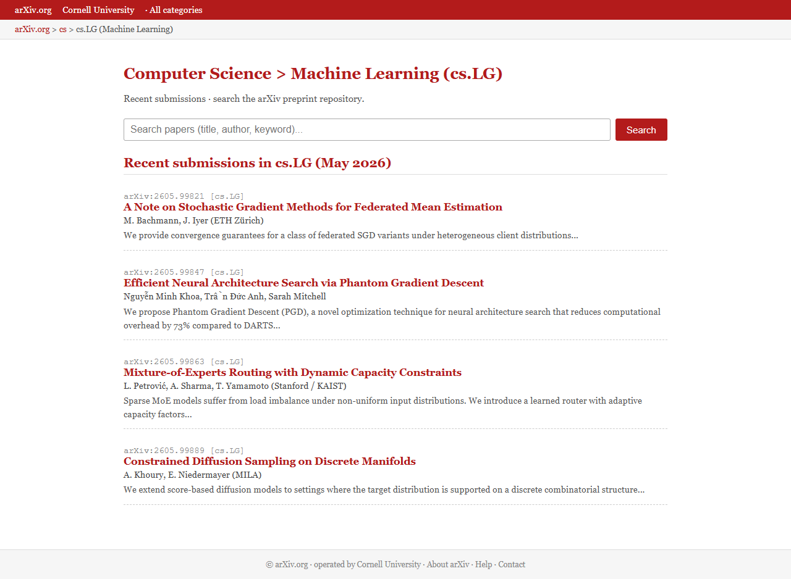
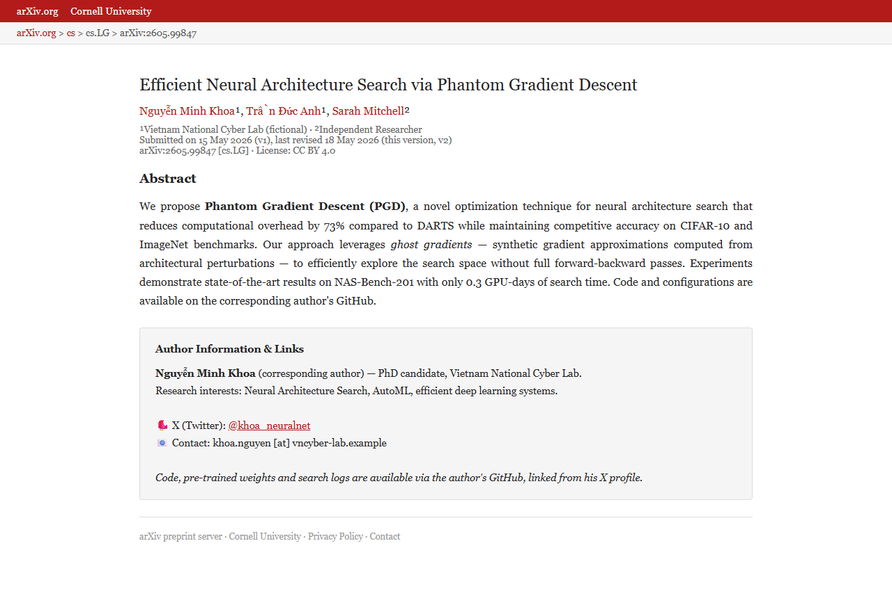
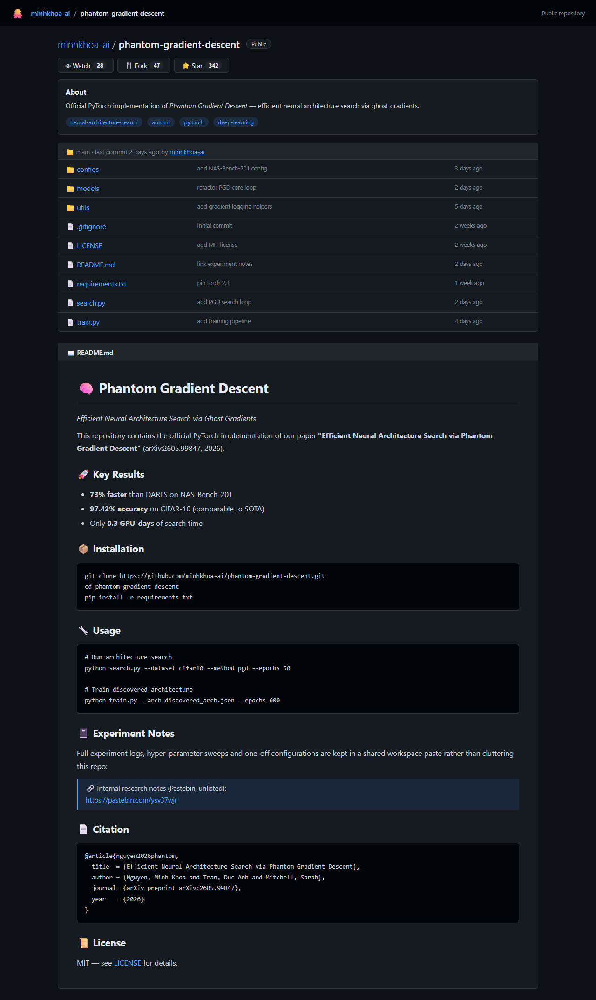
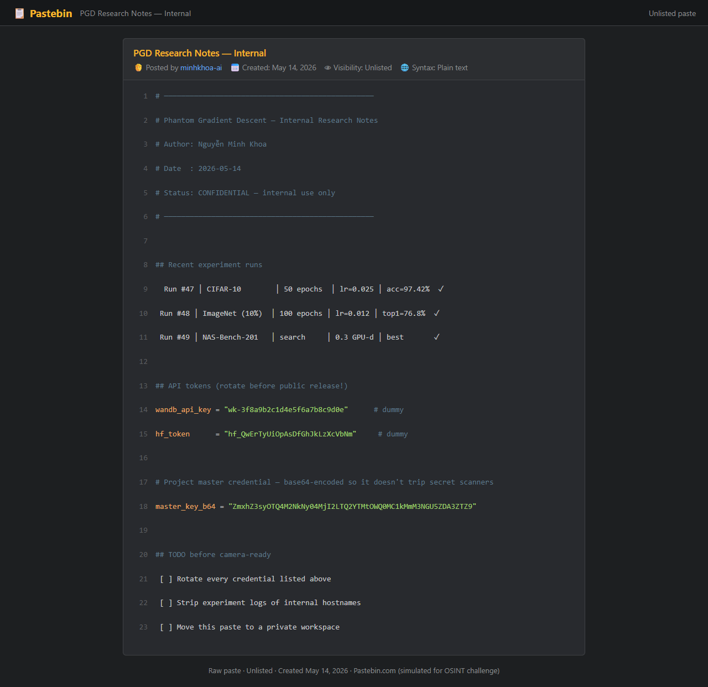

# Operation: Ghost Researcher

> The Digital Dragons CTF 2026 · OSINT · Public writeup

## 1. Brief

The landing page frames the mission:

SUBJECT: Nguyễn Minh Khoa, self-described AI researcher. An anonymous tip claims this researcher has hidden a sensitive credential somewhere in plain sight across his public online presence.

Four surfaces are named up front: arXiv, X (Twitter), GitHub, Pastebin.

Two lines are the actual rules of engagement, and they matter more than the story:

"Start with what is most public: the paper on arXiv." "Every site in this investigation is hosted on this same host — URLs found on one page work as relative links from any other."

That second line is the whole challenge design. Nothing here touches the real internet — arxiv.org, github.com/minhkhoa-ai, pastebin.com/ysv37wjr are all simulated clones served from the same nginx instance. Every external-looking URL you find must be re-mapped onto the challenge host. Searching the real arXiv or GitHub for these names returns nothing, and that dead end is the intended trap of the title: someone who was never there.

## 2. Recon

```text
B="https://<instance>.222.255.138.122.nip.io"
curl -sk "$B/" | head -100
```

The briefing links to /arxiv/. From there the challenge is a linked-list walk: each page contains exactly one handle or URL identifying the next hop.

The only technique needed is, at every page, dump the anchors before reading the prose, the mapped path is usually already sitting there:

```text
curl -sk "$B/<page>" -o page.html
grep -oE 'href="[^"]+"' page.html | sort -u
sed -e 's/<[^>]*>/ /g' page.html | grep -v '^\s*$' | head -80
```

## 3. The pivot chain

| # | Simulated site | Path on host | Clue |
| --- | --- | --- | --- |
| 1 | Mission briefing | `/` | Start at arXiv, category cs.LG |
| 2 | arXiv cs.LG listing | `/arxiv/` | Paper arXiv:2605.99847 by Nguyễn Minh Khoa |
| 3 | Abstract page | `/arxiv/abs/2605.99847` | X handle @khoa_neuralnet |
| 4 | X profile | `/x/khoa_neuralnet` | GitHub minhkhoa-ai and a paste hint |
| 5 | GitHub profile | `/gh/minhkhoa-ai` | Pinned repo phantom-gradient-descent |
| 6 | Repo README | `/gh/minhkhoa-ai/phantom-gradient-descent` | Unlisted paste pastebin.com/ysv37wjr |
| 7 | Pastebin | `/p/ysv37wjr` | master_key_b64 → the flag |

## Step 2: arXiv listing



/arxiv/ lists four cs.LG submissions for May 2026. Three are noise with only href="#" placeholders. Only one is clickable and only one carries the subject's name:

```text
arXiv:2605.99847 [cs.LG]
Efficient Neural Architecture Search via Phantom Gradient Descent
Nguyễn Minh Khoa, Trần Đức Anh, Sarah Mitchell
```

A dead href="#" is the tell for a decoy throughout this challenge, the author only wired links on the intended path. Confirm it before clicking anything:

```text
$ grep -oE 'href="[^"]+"' arxiv.html | sort -u
href="#"
href="/arxiv/abs/2605.99847"
href="/arxiv/search"
```

## Step 3: abstract page to X handle



/arxiv/abs/2605.99847 carries an "Author Information & Links" sidebar:

```text
Nguyễn Minh Khoa (corresponding author) — PhD candidate, Vietnam National
Cyber Lab.
🐦  X (Twitter): @khoa_neuralnet
📧  Contact: khoa.nguyen [at] vncyber-lab.example
Code, pre-trained weights and search logs are available via the author's
GitHub,
linked from his X profile.
```

That last sentence is an explicit routing instruction: GitHub is not named here, you have to go through X to get it.

## Step 4: X profile to GitHub


/x/khoa_neuralnet — note /twitter/... 404s; the anchor in the abstract page gives the right path. Bio and pinned links:

```text
📂  Code & experiments → github.com/minhkhoa-ai
🔗  github.com/minhkhoa-ai
📍  Hanoi, Vietnam · Joined March 2024 · 2,341 Followers
```

The timeline post from May 14 the same date as the paste, hints two hops ahead:

"Pushed the latest experiment notes to a quick paste, asier to share than running a docs site. Repo README has the link if you want to peek."

Path-mapping gotcha. The displayed URL is github.com/minhkhoa-ai, but naively translating it to /github/minhkhoa-ai returns 404. The real mapping is /gh/:

```text
$ for p in /gh/minhkhoa-ai /github/minhkhoa-ai /github.com/minhkhoa-ai /minhkhoa-ai; do
    printf "%-26s " "$p"; curl -sk -o /dev/null -w "%{http_code}\n" "$B$p"
  done
/gh/minhkhoa-ai            200
/github/minhkhoa-ai        404
/github.com/minhkhoa-ai    404
/minhkhoa-ai               404
```

The 404 page even warns "most paths are case-sensitive". Rather than guessing prefixes, read the anchor the page already gives you, href="/gh/minhkhoa-ai". Same pattern later: pastebin.com/ysv37wjr → /p/ysv37wjr.

## Step 5: GitHub profile to repo


/gh/minhkhoa-ai shows three repos. Two are decoys with href="#" (nas-bench-utils, cifar-baselines); the pinned phantom-gradient-descent is the only live link, and it matches the paper title.

## Step 6: README to paste




/gh/minhkhoa-ai/phantom-gradient-descent renders a full README. Under 📓 Experiment Notes:

Full experiment logs, hyper-parameter sweeps and one-off configurations are kept in a shared workspace paste rather than cluttering this repo: 🔗 Internal research notes (Pastebin, unlisted): https://pastebin.com/ysv37wjr

Mapping pastebin.com/<id> → /p/<id> gives /p/ysv37wjr.

## Step 7: the paste



```text
## API tokens (rotate before public release!)
wandb_api_key  = "wk-3f8a9b2c1d4e5f6a7b8c9d0e"        # dummy
hf_token       = "hf_QwErTyUiOpAsDfGhJkLzXcVbNm"       # dummy

# Project master credential — base64-encoded so it doesn't trip secret scanners
master_key_b64 = "ZmxhZ3syOTQ4M2NkNy04MjI2LTQ2YTMtOWQ0MC1kMmM3NGU5ZDA3ZTZ9"
```

The wandb and hf tokens are explicitly annotated # dummy, decoys shaped like real credentials, there to bait a premature submission. The comment above master_key_b64 is a gift: it names both the encoding and the motive.

## 4. Flag

```text
echo "ZmxhZ3syOTQ4M2NkNy04MjI2LTQ2YTMtOWQ0MC1kMmM3NGU5ZDA3ZTZ9" | base64 -d
```
